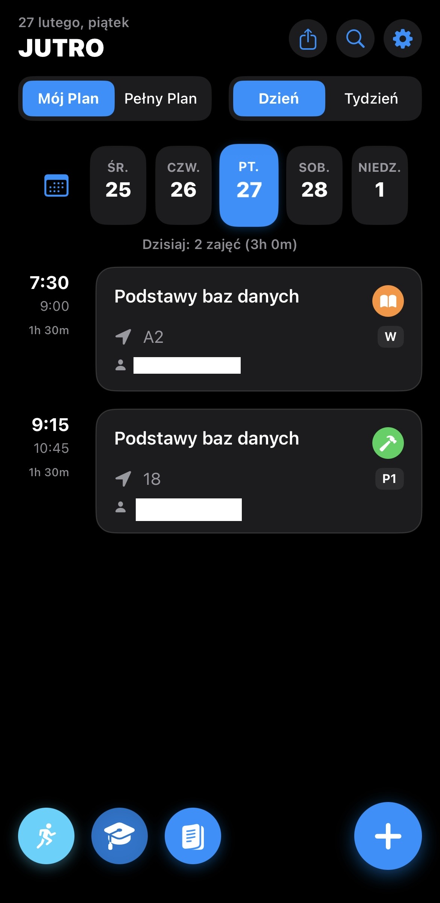
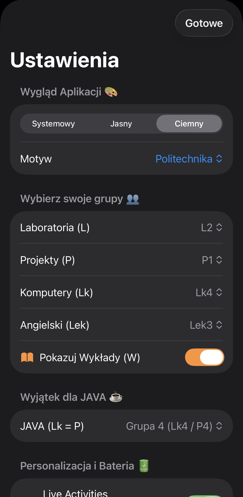
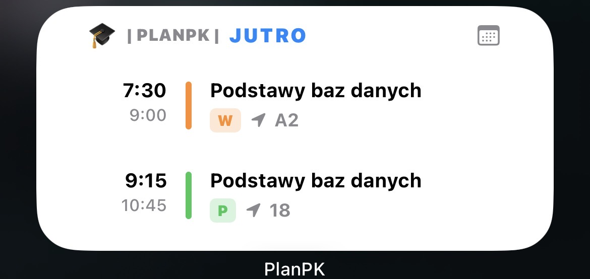

# 🎓 PlanPK - Twój Uczelniany Plan Zajęć

PlanPK to nowoczesna, szybka i w 100% natywna aplikacja dla studentów, napisana w SwiftUI. Zapomnij o brzydkich, webowych planach zajęć. PlanPK przenosi Twoje studia prosto na ekran Twojego iPhone'a, wykorzystując najnowsze technologie ekosystemu Apple.

<p align="center">
  
  
</p>

<p align="center"></p>

## ✨ Główne funkcje

- **Dynamic Island i Live Activities** – Trwające zajęcia wyświetlają się na zablokowanym ekranie i Dynamicznej Wyspie, pokazując czas do końca z dokładnością do sekundy.
- **Widgety na ekranie głównym** – Twój plan na dzisiaj i jutro zawsze na wyciągnięcie ręki (oznaczenia ważnych zajęć i kolokwiów wprost na pulpicie!).
- **Eksport do Kalendarza Apple** – Jednym kliknięciem przeniesiesz cały semestr do systemowego kalendarza.
- **Edycja planu** – Prowadzący zmienił salę albo godziny zajęć? Zaktualizuj to w apce w kilka sekund.
- **Własne wydarzenia** – Dodawaj własne przypomnienia, konsultacje i wydarzenia do planu.
- **Zarządzanie studiami** – Wbudowany moduł do śledzenia ocen, obliczania średniej oraz kontrolowania nieobecności (losówek) wraz z limitami.
- **Zasady zaliczenia** – Zapisuj wymagania wykładowców dla konkretnych przedmiotów.
- **Personalizacja** – Wybierz własny motyw kolorystyczny, filtruj swoje grupy laboratoryjne/projektowe i (opcjonalnie) ukryj wykłady.

## 🛠 Technologie

Projekt został zbudowany z wykorzystaniem nowoczesnych narzędzi Apple:
- **SwiftUI** – Całkowicie natywny, deklaratywny interfejs użytkownika.
- **WidgetKit** – Do obsługi widżetów na Home Screen.
- **ActivityKit** – Obsługa Live Activities na Lock Screen i Dynamic Island.
- **EventKit** – Bezpośrednia integracja z systemowym kalendarzem iOS.
- **Combine** – Reaktywne zarządzanie stanem i odświeżanie UI.

## 🚀 Jak uruchomić projekt?

1. Sklonuj to repozytorium:
   ```bash
   git clone [https://github.com/TWOJA_NAZWA/PlanPK.git](https://github.com/TWOJA_NAZWA/PlanPK.git)
